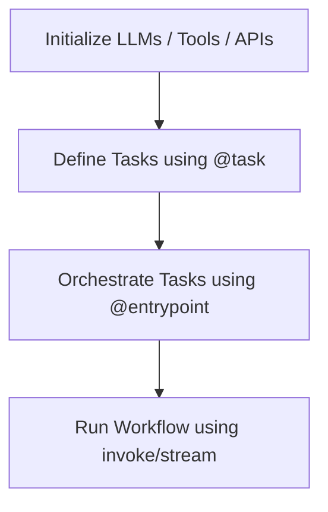
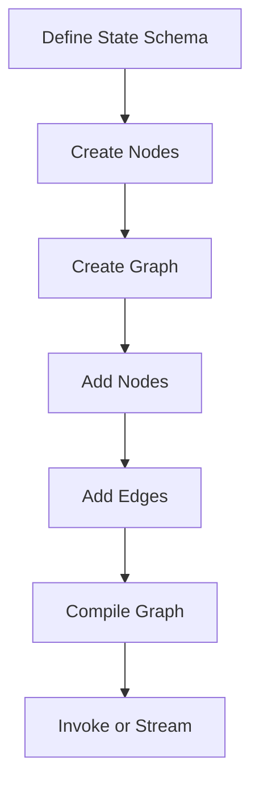
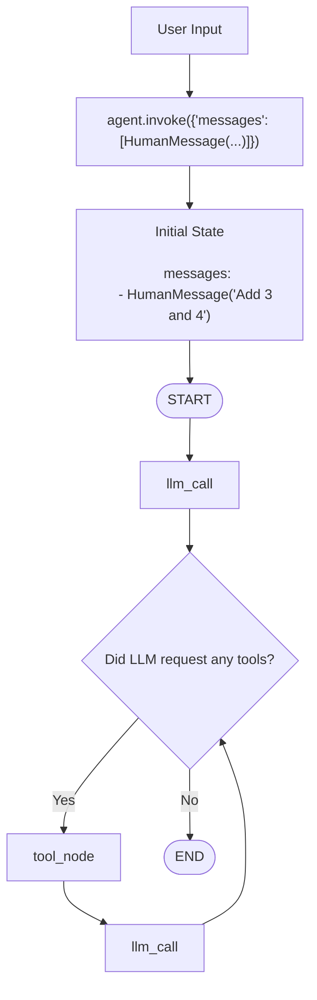
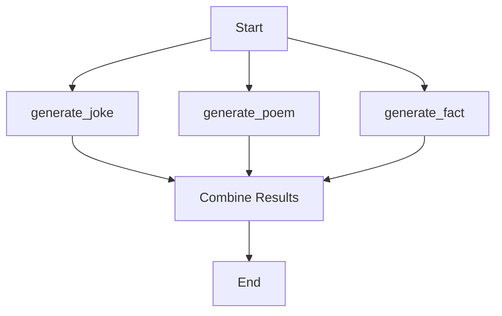

## Message State
- predefined state schema provided by langgraph

```python
from langgraph.graph import MessageState
```
it is a Python class that define what the graph's state should look like

```python
class MessageState:
    message:list
```

whiche measn graph state must contain  a key named message that stores a list of chat messages


```python
def mock_llm(state:MessageState)
```

is equivalent to 
```python
def function(parameter:type) #typehint(or type annotation)
```

Eg:-
```python
def add(a:int,b:int):
    return a+b
```
---
# Functional API code workflow

---
# Graph Api workflow



---
# Graph API vs Functional API in LangGraph

| Feature | Graph API | Functional API |
|----------|-----------|----------------|
| Workflow definition | Explicit graph | Python functions |
| Nodes and edges | Manually defined | Implicit |
| Visualization | Very easy | Less explicit |
| Complex branching | Excellent | Good |
| Parallelization | Excellent | Easy using tasks |
| Cycles/loops | Very natural | Possible but less intuitive |
| Learning curve | Higher | Lower |
| Best for | Large agent systems | Simple workflows |

 Summary

- **Graph API** is ideal for building complex, multi-agent, and long-running workflows.
- **Functional API** is ideal for simple, sequential workflows and feels more like standard Python programming.

---

# add_messages
is a reducer provided by langraph which tells how to update the messages field in the state

"Whenever a node return new msg, append them to the existing converstaion history"
---

## Annotated

Annotated is type hint of Python to attach extra metadeta to a type

```python
from typing import Annotated
```

Basic syntax
```python
Annotated[actual_type,metadata]
```

Eg:-
```python
age:Annotated[int,"Age must be +ve"]
```
---
## AnyMessage

IT represents any kind of chat message

instead of writing :
```python
list[HumanMessage | AIMessage | SystemMessage | ToolMessage]
```

we can write 
```python
list[AnyMessage]
```
---
## Literal
It is a typehint that tells Python "yhis value can be only be one of these specific values
```python 
from typing import Literal
```

--- 
## Conditional Edges

```python
builder.add_conditional_edges(
    source_node,
    routing_function,
    possible_destinations
)
```

---

# Visual Flow of Calculator AGent bu Graph API



---

# .result()
Suppose u have 
```python
@task
def generate_joke(topic: str):
    return "Funny joke"
```

originally 
```python
original_joke = generate_joke(topic)
```

ooriginal_joke does not contain:- *Funny Joke*

Instead it contains a future like object (a placeholder for work that is being executed)

```python
original_joke = <Future pending>
```

the object says: the task has been scheduled . I will give u the actual result once it finishes

thats why we call :
```python
original_joke = generate_joke(topic).result()
```
.result() means:-wait untill the task finishes and then give me its output


So 
```python 
original_joke = generate_joke(topic).result()
```
becomes
**original_joke=Funny joke**

**Important Point**:- *In lanhgraph Functional API , a function decorated with @task always return a future like object not the actual result*

---
# Parallel Workflows


---


