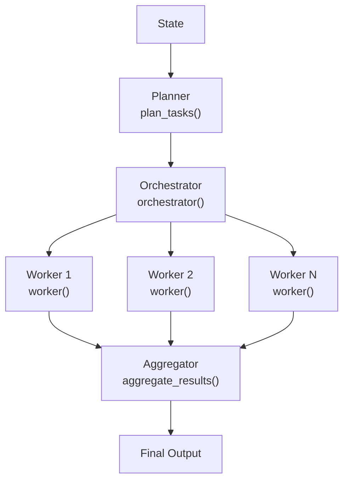

# orchestrator workflow


components needed

### Orchestrator-Worker Pattern Components

| Component    | Purpose                         | Typical Name              |
|--------------|---------------------------------|---------------------------|
| State        | Stores shared workflow data     | `State`                   |
| Planner      | Creates and decomposes tasks    | `plan_tasks()`            |
| Worker       | Executes a single task          | `worker()`                |
| Aggregator   | Combines worker outputs         | `aggregate_results()`     |
| Orchestrator | Coordinates the entire workflow | `orchestrator()`          |

### Workflow




---

# Send API

The Send API is a mechanism in LangGraph that lets you:

👉 Dynamically spawn multiple worker executions during runtime and send each one custom input + state

In langgraph

```python
Send(target_node,input_data)
```
means_ Run target node with this specific input